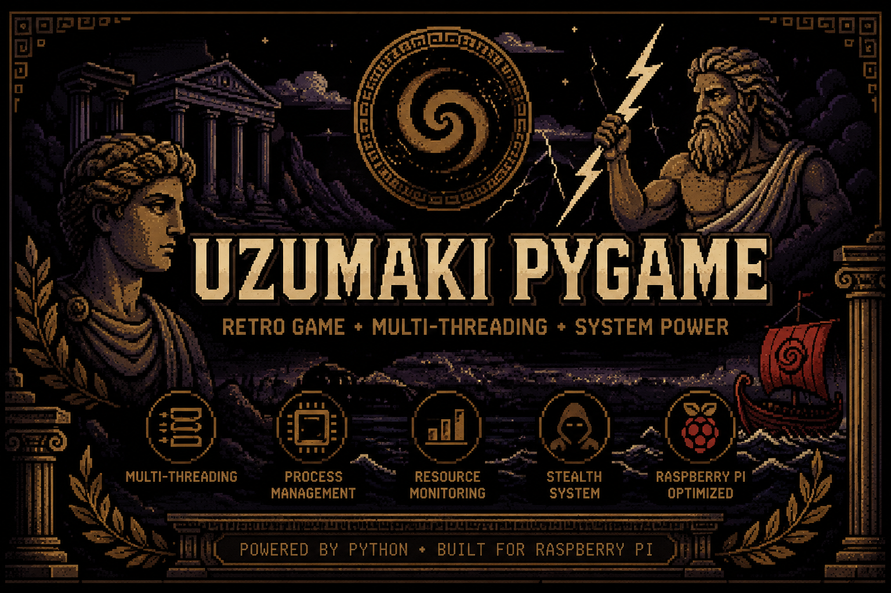
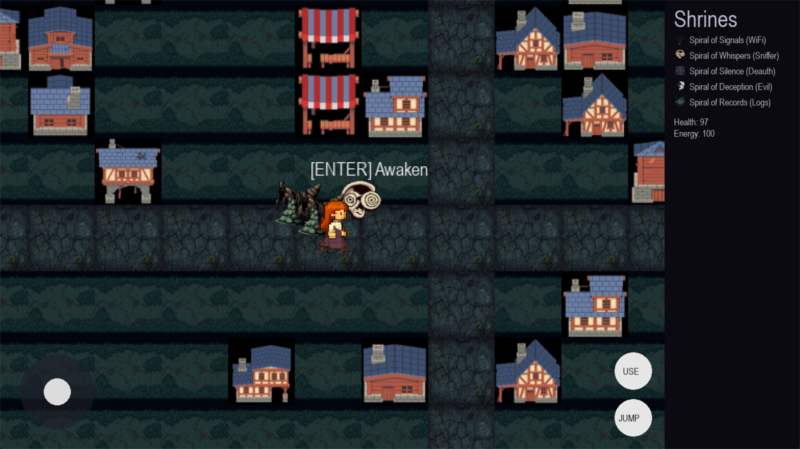
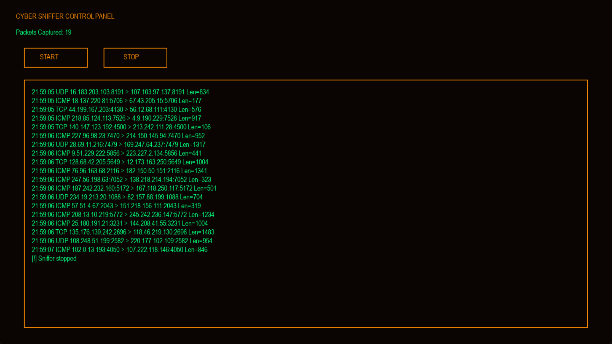
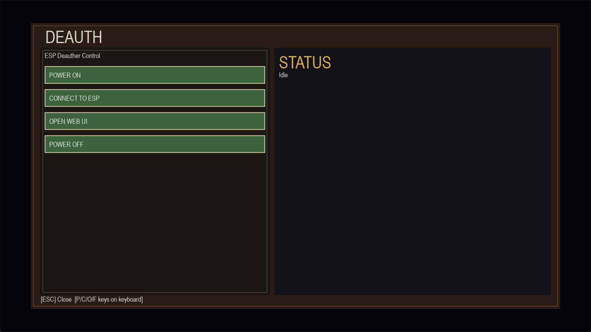

<p align="center">
  
</p>

<h1 align="center">🌀 Uzumaki Pygame</h1>

<p align="center">
  Raspberry Pi • Pygame • Multi-threading • System Management
</p>

Uzumaki Pygame is a Raspberry Pi–based cybersecurity demonstration platform disguised as a simple game interface. While users interact with a retro-style game environment, the system can execute authorized security testing modules in the background, showcasing concepts such as process management, multi-threading, remote administration, and system automation.

The project was developed as an educational and research-oriented platform for studying Raspberry Pi performance, background task execution, remote device management, and cybersecurity tool integration. It demonstrates how multiple security-related services can operate concurrently while maintaining a responsive user interface.

Key Features
Retro-style Pygame interface
Multi-threaded background task execution
Raspberry Pi optimized architecture
Remote administration support
Process and resource management
Modular cybersecurity testing framework
Educational demonstration of concurrent system operations
Educational Objectives

This project helps students understand:

Multi-threading and multiprocessing
Raspberry Pi system administration
Background service management
Remote device operation

## 🚀 Features

- Interactive game interface
- Multi-threaded architecture
- Resource monitoring
- Lightweight design
- Raspberry Pi compatible

## 🔧 Hardware Configuration

This project is designed around a Raspberry Pi CM4 embedded platform.

### Main Components

* Raspberry Pi Compute Module 4 (CM4)
* Waveshare PoE UPS Base Board
* 4-inch HDMI Display
* ESP8266 NodeMCU
* USB Wi-Fi Adapter
* AMS1117 Voltage Regulation Circuit

### Software Stack

* Raspberry Pi OS
* Python 3
* Pygame
* Multi-threaded task execution
* Network management modules

# 🏗️ System Architecture

The Uzumaki Pygame platform is built around a Raspberry Pi Compute Module 4 (CM4) running Raspberry Pi OS. The system combines an interactive Pygame-based user interface with multiple background services responsible for hardware communication, system monitoring, and network-related operations.

The primary goal of the project is to demonstrate how a single embedded platform can simultaneously provide a responsive graphical interface while managing multiple backend processes in real time.

## Architecture Overview

```text
                          Mobile Phone
                          (VNC Viewer)
                                 │
                                 │ Wi-Fi
                                 ▼
┌──────────────────────────────────────────────────────┐
│                Raspberry Pi CM4                      │
│                                                      │
│          Raspberry Pi OS (Linux)                     │
│                                                      │
│  ┌──────────────────────────────────────────────┐    │
│  │              Uzumaki Pygame                  │    │
│  │                                              │    │
│  │  Main Interface                              │    │
│  │  System Dashboard                            │    │
│  │  Hardware Controls                           │    │
│  │  Monitoring Panels                           │    │
│  └────────────────┬─────────────────────────────┘    │
│                   │                                  │
│                   ▼                                  │
│  ┌──────────────────────────────────────────────┐    │
│  │         Background Service Layer             │    │
│  │                                              │    │
│  │ • Multi-threaded Task Manager                │    │
│  │ • Resource Monitoring                        │    │
│  │ • Hardware Communication                     │    │
│  │ • Logging and Diagnostics                    │    │
│  │ • Network Management                         │    │
│  └───────────────┬──────────────────────────────┘    │
└──────────────────┼───────────────────────────────────┘
                   │
                   │ UART Communication
                   ▼
          ┌──────────────────────┐
          │    ESP8266 NodeMCU   │
          │                      │
          │ Auxiliary Controller │
          └──────────────────────┘

                   │
                   ▼

          ┌──────────────────────┐
          │ USB Wi-Fi Adapter    │
          │ Network Interface    │
          └──────────────────────┘

                   │
                   ▼

          ┌──────────────────────┐
          │ 4" HDMI Display      │
          │ Pygame Interface     │
          └──────────────────────┘
```

## Workflow

### 1. System Startup

When power is supplied through the Waveshare PoE UPS Base Board, the Raspberry Pi CM4 boots into Raspberry Pi OS. During startup, the operating system initializes hardware drivers, networking components, display services, and application dependencies required by the project.

### 2. Remote Access

The user connects to the Raspberry Pi using a mobile phone running VNC Viewer. This allows remote control of the embedded system without requiring a keyboard, mouse, or dedicated monitor.

### 3. Application Launch

After connecting to the system, the user launches the Uzumaki Pygame application. The graphical interface appears on the 4-inch display and serves as the primary control dashboard for the platform.

### 4. Background Service Initialization

While the user interacts with the graphical interface, several background threads and processes are executed simultaneously. These services operate independently of the user interface and continue running without interrupting the gaming experience.

### 5. Hardware Communication

The Raspberry Pi communicates with the ESP8266 NodeMCU through a dedicated connection. The ESP8266 acts as an auxiliary controller and extends the overall capabilities of the platform.

### 6. System Monitoring

Throughout operation, the platform continuously monitors system resources including:

* CPU utilization
* Memory usage
* Network activity
* Thread execution
* Hardware status

This demonstrates real-world embedded system design where user-facing applications and backend services operate concurrently.

## Hardware Components

### Raspberry Pi Compute Module 4

The central processing unit responsible for executing the operating system, running the Pygame application, and managing all background services.

### Waveshare PoE UPS Base Board

Provides power management, battery backup functionality, and carrier-board support for the CM4.

### ESP8266 NodeMCU

Functions as an auxiliary microcontroller used for wireless communication and hardware interaction.

### USB Wi-Fi Adapter

Provides additional wireless networking capabilities for network-based functionality and experimentation.

### 4-inch HDMI Display

Displays the Pygame user interface and system information.

## Educational Objectives

This project demonstrates practical concepts in:

* Embedded Linux systems
* Raspberry Pi development
* Python programming
* Pygame application development
* Multi-threading
* Process management
* Hardware integration
* Remote administration
* System monitoring
* Network technologies

The result is a compact embedded platform that combines an engaging graphical interface with real-world system engineering concepts, making it a valuable educational and research-oriented project.

## 📸 Screenshots

### Main Interface



### Packet Scanner



### Deauth Tool



## 🛠 Requirements

```bash
pip3 install -r requirements.txt
```

Install dependencies:
Run
python main.py

## 📂 Project Structure

```text
uzumaki-pygame/
│
├── assets/
├── images/
├── sounds/
├── src/
│   └── main.py
└── README.md
```
#Future Improvements
Leaderboard
Sound effects
Animations
Multiplayer support

```bash
pip install pygame
```
## 👨‍💻 Author

<p align="center">
  
</p>

<p align="center">
  <b>Vrunal Patil</b><br>
  Computer Science Student<br>
  Raspberry Pi & Cyber Security Enthusiast
</p>
